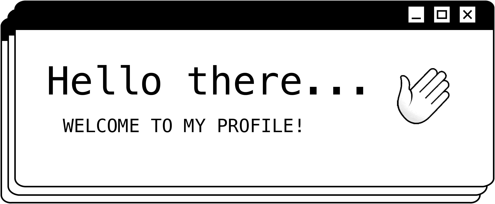

<!-- HERO "HELLO THERE" IMG/GIF -->

<!-- BIO -->

  My name is Abby. I am a Full Stack Developer (in training...shhhhh). 
  I'm passionate about learning and finding new ways to challenge 
  myself in my work. I have a strong interest in UI/UX Design and I'm 
  eager to explore whatever comes my way. The learning never ends, nor do I want it to!

  

  

  <!-- ICONS -->
  &nbsp;&nbsp;&nbsp;&nbsp;&nbsp;&nbsp;
   
  &nbsp;&nbsp;&nbsp;&nbsp;&nbsp;&nbsp;
  
  &nbsp;&nbsp;&nbsp;&nbsp;&nbsp;&nbsp;
  
  &nbsp;&nbsp;&nbsp;&nbsp;&nbsp;&nbsp;
  
  &nbsp;&nbsp;&nbsp;
  

 
 

<!-- CONNECT WITH ME -->

  &nbsp;Connect with Me

  
  &nbsp;&nbsp;&nbsp;
  
  &nbsp;&nbsp;&nbsp;
  

<!-- ░░░░░░░░░░░░░░░░░░░░░░░░░░░░░░░░░░░░░░░░░░░░░░░░░░░░░░░░░░░░░░░░░░░░░░░░░░░░░░░░░░░░░░░░░░░░░░░░ -->

<!-- NOT IN USE - OLD HEADER╱╱TYPING TEXT -->

<!-- ORIGINAL BASIC HEADER/TITLE -->
<!-- <h1 style="color: white; font-size:32px">
  Hello there&nbsp;
  
</h1> -->

<!-- TYPING TEXT -->
<!-- 

  &nbsp; 

 -->

<!-- SHORT LITTLE BLURB ABOUT LIFE -->
<!-- 

  One thing I know for sure is that I've definitley found what I'm meant to do with this life.
    Code. Code. Code.  
  There's no stopping me now...muahahah 

 -->

<!-- GITHUB STATS╱TOP LANGS (IN USE JUST IN DIFF FORMAT)-->
<!--  &nbsp;&nbsp;  -->

<!-- POINTER CURSOR -->
<!--  -->

<!-- INFO ON STUFF TO INCLUDE IN README -->
<!--
**abbygraves/abbygraves** is a ✨ _special_ ✨ repository because its `README.md` (this file) appears on your GitHub profile.

Here are some ideas to get you started:

- 🔭 I’m currently working on ...
- 🌱 I’m currently learning ...
- 👯 I’m looking to collaborate on ...
- 🤔 I’m looking for help with ...
- 💬 Ask me about ...
- 📫 How to reach me: ...
- 😄 Pronouns: ...
- ⚡ Fun fact: ...
-->
