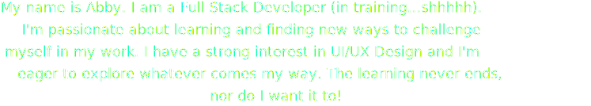

  <!-- HERO "HELLO THERE"-->
  

   
   

  <!-- BIO -->
  

   

  <!-- THINGS I'M GOOD AT -->
  

  <!-- ICONS -->
  &nbsp;&nbsp;&nbsp;&nbsp;&nbsp;&nbsp;
   
  &nbsp;&nbsp;&nbsp;&nbsp;&nbsp;&nbsp;
  
  &nbsp;&nbsp;&nbsp;&nbsp;&nbsp;&nbsp;
  
  &nbsp;&nbsp;&nbsp;&nbsp;&nbsp;&nbsp;
  
  &nbsp;&nbsp;&nbsp;
  

   
   

<!-- GITHUB STATS -->
  

<!-- CONNECT WITH ME -->
  
  

    Connect with Me
  

  
  
  &nbsp;&nbsp;&nbsp;
  
  &nbsp;&nbsp;&nbsp;
  

